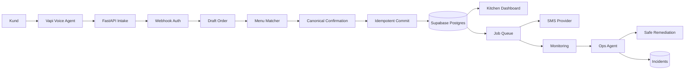

# Live Readiness Audit Och Produktionsplan

## Beslut

Gislegrillen-systemet är inte redo att säljas som en nära felfri produkt till pizzerior ännu.

Det finns en fungerande prototyp med Vapi, FastAPI, menyvalidering, orderlagring, Supabase, SMS och köksdashboard. Grunden är bra, men de delar som avgör om en riktig pizzeria kan lita på systemet i rusningstid är ännu inte tillräckligt starka: orderintegritet, idempotency, databas som enda sanning, dashboard-säkerhet, driftövervakning, fallback-flöden och testad återhämtning.

Den viktigaste affärsrisken är inte att systemet ibland kan ta en order. Den viktigaste risken är att systemet kan ta fel order, dubbelregistrera en order, missa att visa en order i köket eller ge success trots att kritiska följdsteg har fallerat.

## Produktmål

Målet är en pizzeria-produkt där restaurangen kan lita på att:

- Kunden kan ringa och lägga en beställning utan att personalen svarar.
- Rätt rätter, antal, ändringar och totalpris hamnar i köket.
- En order aldrig skapas dubbelt vid retry, timeout eller dubbla Vapi-format.
- En order aldrig returnerar success om köket inte kan se den.
- Systemet upptäcker problem automatiskt och åtgärdar säkra fel utan mänsklig insats.
- Osäkra situationer stoppas, eskaleras eller skickas till människa istället för att gissa.
- Varje pizzeria är isolerad från andra pizzerior med egen meny, egna inställningar, egna order och egen driftstatus.

## Nuvarande Arkitektur

Systemet är idag en monolitisk FastAPI-app i `main.py`.

Huvudflödet är:

1. Kunden ringer till Vapi.
2. Vapi-assistenten följer prompten i `system_prompt.md`.
3. Vapi anropar `/place_order` eller `/vapi/webhook`.
4. Backend extraherar tool calls och items.
5. `menu_match.py` matchar rätter mot `menu.json`.
6. Backend räknar pris från serverns meny.
7. Ordern sparas i lokal `orders.json`.
8. Backend försöker skriva samma order till Supabase.
9. Dashboarden i `index.html` läser lokala ordrar via `/orders`.
10. SMS försöker skickas via Vonage om kundtelefon finns.

Det här fungerar som demo- och första kund-flöde, men arkitekturen har split brain: lokal fil och Supabase kan skilja sig åt. För en kommersiell SaaS-produkt ska databasen vara enda sanning.

## Kritiska Risker

### P0: Order Kan Bli Dubbel

Det finns ingen persistent idempotency. `_extract_vapi_tool_calls` deduplicerar bara tool call-id inom samma request. Om Vapi, nätverket eller Railway gör retry efter att ordern redan skapats kan samma kundorder skapas igen med nytt order-id.

Detta blockerar live-försäljning.

Krav:

- Spara idempotency-nyckel i Supabase/Postgres.
- Nyckeln ska baseras på minst `restaurant_uuid`, Vapi `call_id`, `tool_call_id` och fallback payload-hash.
- Unik constraint ska hindra dubbla ordrar även vid samtidiga requests.
- Vid retry ska backend returnera samma tidigare orderresultat, inte skapa en ny order.

### P0: Order Kan Vara Synlig På Ett Ställe Men Inte Ett Annat

Order sparas först i `orders.json`. Supabase-insert kan misslyckas efteråt, men backend kan ändå returnera success. Då kan en lokal dashboard visa ordern medan Supabase/Lovable/KDS inte gör det.

Detta blockerar live-försäljning.

Krav:

- Supabase/Postgres ska vara primär och transaktionell orderkälla.
- `orders.json` ska tas bort från hot path eller bara användas som lokal debug-export.
- Success till Vapi får bara skickas när ordern är committed i system of record.

### P0: Fel Rätt Kan Skapas Om `id` Och `name` Inte Matchar

I `menu_match.py` vinner ett giltigt `id` över `name`. Om AI skickar `id=13` men `name="Kebabpizza"` skapas artikel 13 istället för Kebabpizza.

Detta blockerar "nära felfritt" orderlöfte.

Krav:

- Om både `id` och `name` finns måste de peka på samma menyartikel.
- Vid mismatch ska servern returnera `success:false` och be assistenten reda ut det.
- Alternativt ska backend ignorera AI-genererat `id` och alltid matcha på kundens/canonical `name`.

### P0: Kundens Bekräftelse Är Inte Tillräckligt Säker

Prompten tillåter vägar där ordern placeras utan full uppläsning efter vissa svar eller ändringar. Det gör att taligenkänningsfel eller LLM-fel kan gå direkt till köket.

Krav:

- Alltid en minimal canonical read-back före final commit.
- Efter ändring måste den ändrade ordern bekräftas igen.
- Servern bör stödja tvåstegsflöde: `draft_order` först, `confirm_order` eller `place_order` med confirmation token efter bekräftelse.

### P0: Dashboard Och Status-API Är Inte Säkra

`/dashboard`, `/orders` och `/update_order_status` saknar riktig auth. Alla med URL kan se och ändra orderstatus. Dashboarden renderar kundstyrd text i HTML, vilket ger XSS-risk.

Krav:

- Köksdashboard ska kräva auth.
- Statusuppdateringar ska vara behörighetskontrollerade per restaurang.
- Rendera kunddata säkert med text nodes eller escaping.
- Status ska vara enum: exempelvis `pending`, `ready`, `completed`, `cancelled`.

### P1: Webhook-Säkerhet Är Valfri

`WEBHOOK_SHARED_SECRET` skyddar Vapi-endpoints endast om env-var är satt. Om den saknas är `/place_order` och `/vapi/webhook` öppna.

Krav:

- I produktion ska appen vägra starta eller vägra orderintag om webhook secret saknas.
- `VAPI_API_KEY` ska inte visas som trygghet för inbound auth om den inte faktiskt verifierar webhooks.

### P1: Quantity Och Special Requests Är För Lösa

`quantity` saknar tydliga affärsgränser. `special_requests` är fri text och är inte kopplad till strukturerade tillval eller pris.

Krav:

- `quantity` måste vara heltal, minst 1 och ha rimlig maxgräns.
- Tom order ska avvisas.
- Special requests ska ha maxlängd.
- Betalda tillval ska vara strukturerade radartiklar eller modifierare, inte bara text.

### P1: Driftövervakning Är För Svag

Det finns många `print()`-loggar, men ingen riktig incidentmodell, inga metrics, ingen tracing, inga SLO:er och inga alerts utanför loggarna.

Krav:

- Strukturerade logs med correlation id per samtal/order.
- `order_events` eller audit log i databas.
- `incidents`-tabell för automatiska driftproblem.
- Health checks som testar verklig DB-åtkomst och kritiska integrationer.
- Alerting till ägare/ops vid P0/P1-problem.

### P1: Manuell Schemahantering Skapar Drift

Supabase SQL-filer finns som manuella steg. Koden har många fallbackar för saknade kolumner. Det minskar krascher, men ökar risken att miljöer inte är lika.

Krav:

- Versionerade migrationer.
- Staging och production ska kunna verifieras mot samma schema.
- Appen ska ha startup-check som markerar schema som `ok`, `warning` eller `blocked`.

## Konkurrentgap

Konkurrenter inom AI-phone ordering för restaurang/pizzeria, till exempel Rush Spike, Voicify, VOICEplug PizzaVOICE, Takeorder AI och Ring to Kitchen AI, säljer inte bara en röstbot. De säljer en driftad orderplattform.

De återkommande capabilities de marknadsför är:

- AI svarar alltid och kan hantera flera samtidiga samtal.
- Meny och priser synkas med POS eller ordering system.
- Komplexa pizzabeställningar med storlek, toppings, half-and-half, kuponger och modifieringar.
- Ordern bekräftas före kök.
- POS/KDS-integration gör att order går direkt in i restaurangens arbetsflöde.
- Kundminne: namn, adress, tidigare order, preferenser och loyalty.
- Upsell: bröd, dryck, dessert, extra topping.
- Betalning via kort på fil eller säker SMS-länk.
- Orderstatus och kundkommunikation efter beställning.
- Monitoring, uptime-löften, support och fallback till människa.

Gislegrillen har idag en bra start på meny-matchning och serverstyrda priser, men saknar flera produktlager som konkurrenterna använder för att skapa förtroende:

- Ingen POS-sync.
- Ingen säker betalning.
- Ingen kundprofil/adress/historik.
- Ingen fullständig modifierar-/toppingsmodell.
- Ingen persistent idempotency.
- Ingen tydlig uptime/SLO/incidentprocess.
- Ingen human handoff-policy vid låg confidence.
- Ingen kommersiell multi-tenant dashboard med auth och tenant-isolering.

## Målarkitektur

Supabase/Postgres ska bli enda sanning för:

- Restauranger och tenants.
- Menyer och menyversioner.
- Ordrar och orderrader.
- Idempotency records.
- Samtal, tool calls och audit events.
- Incidenter och automatiska åtgärder.
- SMS/jobbar och retry-status.

Backend ska vara en ordermotor, inte en filbaserad orderbok.

## Autonom Problemlösning

En agent ska inte få "göra vad som helst" i produktion. Självläkning måste vara policy-styrd.

Säkra automatiska åtgärder:

- Retry av SMS med backoff.
- Markera SMS som failed efter max retries.
- Invalidera meny- eller tenant-cache.
- Pausa orderintag för en tenant om schema/config är trasig.
- Skapa incident med tydlig orsak och länk till order/call.
- Reconcila order_events mot orders och hitta saknade följdsteg.
- Återskapa icke-destruktiva views/projektioner från audit log.
- Notifiera ägare via Slack/SMS/email när mänsklig åtgärd krävs.

Åtgärder som inte ska ske helt automatiskt utan policy eller godkännande:

- Ändra menypriser.
- Radera ordrar.
- Modifiera bekräftad kundorder.
- Ändra betalningsstatus.
- Ändra tenantens auth/RLS-regler.
- Pusha kod till produktion.

## Go-Live Gate

Systemet bör inte säljas externt förrän dessa gates är gröna:

- Order kan inte dubbleras vid retry.
- Order sparas atomiskt i Supabase.
- Dashboard läser samma datakälla som ordermotorn.
- Vapi success skickas bara när ordern är synlig för köket.
- Prompt och server kräver canonical orderbekräftelse.
- `id/name` mismatch avvisas.
- Quantity, status och special requests valideras.
- Webhook secret är obligatorisk i produktion.
- Dashboard och status-API kräver auth.
- Debug endpoints är avstängda eller admin-skyddade i produktion.
- XSS-risk i dashboard är åtgärdad.
- Supabase RLS och tenant-isolering är verifierad.
- Schema migrationer är versionerade och verifierbara.
- Monitoring, incidents och alerts finns.
- E2E-test täcker Vapi-format, retry, concurrency, Supabase-fel, dashboard och SMS-fel.

## Fas 1: Order Integrity Hardening

Målet med Fas 1 är att göra den kritiska orderkedjan säljbar för en pilotpizzeria.

Leveranser:

1. Lägg till Supabase-migration för idempotency och order constraints.
2. Flytta order-commit till Supabase som primär källa.
3. Gör `orders.json` till debug/fallback-export eller ta bort från produktionens orderflöde.
4. Implementera idempotent create-order-funktion.
5. Returnera befintligt orderresultat på retry.
6. Avvisa `id/name` mismatch.
7. Lägg quantity- och special request-validering i Pydantic-modeller.
8. Lägg status enum och DB-synkad statusuppdatering.
9. Säkerställ att Supabase-fel inte returnerar success.
10. Lägg tester för retry, concurrency och Supabase-fel.

Acceptanskriterier:

- Samma Vapi tool call kan skickas fem gånger och ger exakt en order.
- Två samtidiga identiska requests skapar exakt en order.
- Om Supabase är nere returnerar backend `success:false` och ingen falsk köksbekräftelse.
- Om AI skickar fel `id` till rätt `name` avvisas ordern.
- Dashboard visar ordern från Supabase, inte `orders.json`.

## Fas 2: Confirmation Och Menu Truth

Målet med Fas 2 är att minska risken för fel rätt mellan kundens tal och köket.

Leveranser:

- Inför `draft_order` som matchar och returnerar canonical items, priser och total.
- Inför confirmation token eller order hash innan final commit.
- Generera Vapi-prompt eller menysektion från `menu.json`/DB istället för manuell hårdkodning.
- Justera prompten så ändringar alltid bekräftas innan commit.
- Strama åt fuzzy auto-accept och logga confidence per rad.
- Strukturera betalda tillval.

Acceptanskriterier:

- Kunden får alltid en canonical sammanfattning före commit.
- Servern kan bevisa vilken canonical order kunden bekräftade.
- Prompt, meny och serverkontrakt kan inte glida isär utan testfel.

## Fas 3: Security, Tenant Isolation Och Dashboard

Målet med Fas 3 är att kunna onboarda fler pizzerior utan att blanda data.

Leveranser:

- Auth på dashboard.
- Tenant-scopade queries och statusuppdateringar.
- RLS policies som matchar faktisk användarmodell.
- Gated debug/admin endpoints.
- CORS låst till tillåtna origins.
- Per-tenant meny, telefonnummer, SMS-provider/secrets och öppettider.
- Onboarding-check som verifierar tenant innan go-live.

Acceptanskriterier:

- En restaurang kan inte läsa eller ändra en annan restaurangs order.
- En obehörig användare kan inte öppna dashboarden.
- Ny pizzeria kan onboardas utan kodändring i `main.py`.

## Fas 4: Observability Och Självläkning

Målet med Fas 4 är att ägaren inte ska behöva leta i Railway-loggar när problem inträffar.

Leveranser:

- Strukturerade JSON-logs.
- Correlation id: `call_id`, `tool_call_id`, `restaurant_uuid`, `order_id`.
- `order_events` för varje state transition.
- `incidents` för driftproblem.
- Jobbtabell för SMS, retries och reconciliation.
- Alerting till ägare/ops.
- Ops-agent med allowlistade åtgärder.

Acceptanskriterier:

- Varje misslyckad orderkedja skapar en incident.
- SMS-fel retrys automatiskt utan att blockera order.
- Cache/config-problem kan åtgärdas eller pausas automatiskt.
- Alla automatiska åtgärder är audit-loggade.

## Fas 5: Kommersiell Produktisering

Målet med Fas 5 är att kunna sälja systemet som en riktig tjänst.

Leveranser:

- Standardiserad onboarding för ny pizzeria.
- Menyimport från POS eller strukturerat adminflöde.
- Kundprofiler: telefonnummer, namn, adress, tidigare order.
- Upsell-regler per restaurang.
- Betalningsstrategi: SMS-länk, kort på fil eller POS-betalning.
- SLA, supportprocess och incidentkommunikation.
- Staging/prod-miljöer.
- Backup/restore och data retention.
- Pilotprogram med mätetal: missade samtal, order accuracy, manuella ingripanden, dubletter, time-to-kitchen.

## Rekommenderad Sprintordning

Sprint 1 ska bara fokusera på orderintegritet:

- Idempotency.
- Supabase som enda orderkälla.
- Hård inputvalidering.
- Status enum.
- Tester för retry och concurrency.

Sprint 2 ska fokusera på att ordern blir rätt:

- Draft/confirm-flöde.
- Promptjustering.
- `id/name` invariant.
- Meny/prompt-generering.

Sprint 3 ska fokusera på drift och säkerhet:

- Auth på dashboard.
- Debug endpoint-gating.
- Webhook secret obligatorisk.
- Strukturerad logging och incidents.

Sprint 4 ska fokusera på multi-tenant och pilot:

- Tenant-isolering.
- Onboarding-check.
- Pilotpizzeria go-live checklist.
- Mätning och supportflöde.

## Slutbedömning

Det här projektet kan bli en riktig produkt, men det måste behandlas som ett orderkritisk system, inte som en röst-demo.

Den största styrkan idag är att backend redan har serverstyrd menyprissättning, fuzzy/alias-matchning och grundläggande Supabase/Vapi/SMS-integration. Den största svagheten är att de kritiska garantierna runt orderns livscykel saknas.

Nästa tekniska steg bör vara Fas 1. Ingen funktion som upsell, kundminne, betalning eller fler restauranger bör prioriteras före att en order aldrig tappas, dubbleras eller bekräftas falskt.
